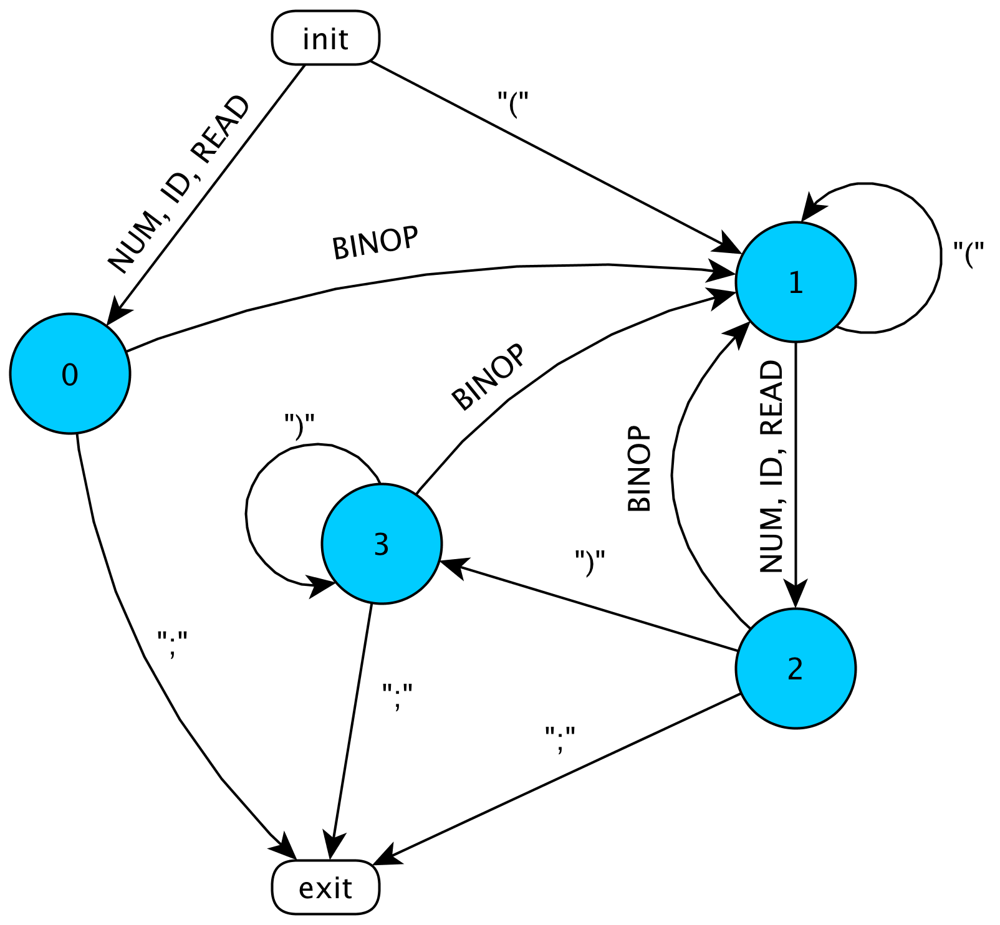

== Simple language compiler

Ниже представлена грамматрика языка.
Нетерминальные символы зыключены к двойные ковычки `"`, за исключение выражения, описывающего `STR`, там они заключены 
в одинарные ковычки `'`. Символ `ANY` означет любой символ.

[source, basic]
----
S       ->    L {L}
L       ->    (A | I | C) ";"
A       ->    "print" (STR | NUM | ID)
I       ->    ["int"] ID "=" E
C       ->    "str" ID "=" STR
E       ->    T | E LBINOP T
T       ->    F | T HBINOP F
F       ->    "read" | ID | NUM | "(" E ")"
STR     ->    '"' {ANY}/{'"'} '"'
ID      ->    char {char | "_" | digit}
char    ->    "a" | ... | "z" | "A" | ... | "Z"
digit   ->    "0" | ... | "9"
LBINOP  ->    "+" | "-"
HBINOP  ->    "*" | "/" | "%"
----

В языке предусмотрена возможность записывать комментарии. Для этого перед комментарием необходимо написать `\#`. Тогда 
лексический анализатор проигнорирует все символы после `#` до символа переноса строки.

Пример кода:
[source, python]
----
#Считываем целое число и записываем в x
print "Введите значение x";
int x = read;
#Считываем целое число и записываем в y
print "Введите значение y";
int y = read;
#Выполняем некоторое выражение
int z = x * y;
#Печатаем результат
print z;
----

=== Лексический анализатор 

Лексический анализатор разбивает входной тексовый файл на список токенов, игнорируя все незначащие символы `\t`, `\n`, `" "`. 
Токен имеет три параметра: `type`, `str` и `line`.
Типы токенов:

* _ID_      - идентификатор
* _KWORD_   - ключевое слово
* _LBRC_    - открывающая скобка
* _RBRC_    - закрывающая скобка
* _BINOP_   - бинарная операция `+-=*/%`
* _NUM_     - целое число
* _STR_     - строка
* _SCLN_    - символ `;`
* _TEDN_    - конец токенов

Для токенов `ID`, `NUM` и `STR` задается праметр `str`. Далее полученный список токено скармливается 
синтаксическому анализатору. 

=== Синтаксический анализатор

Синтаксический анализ языка довольно прост. Каждое выражение `L` должно начинаться с одно из следующих символов 
`ID`, `"print"`, `"int"`. Поэтому можно сразу определить какие символы должны стоять дальше. Заканчиваться любое выражение `L`
должно символом `;`. Проблема возникает при анализе арифметических выражений. Для них был использован конечный автомат.

Здесь под `BINOP` подразумевается `{BINOP}/{"="}`, а под `READ` - `KWORD: "read"`. Слово `init` указывается на точки входа
в автомат, а `exit` - на точки выхода.

